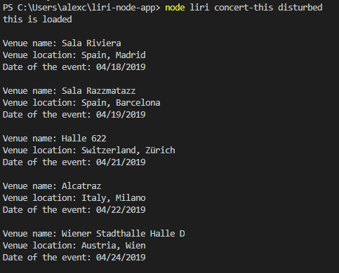
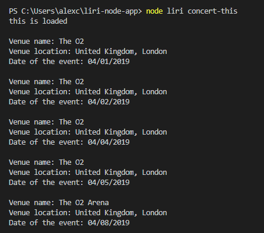
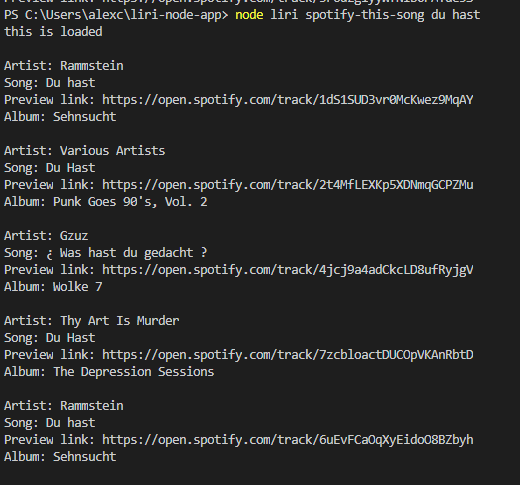
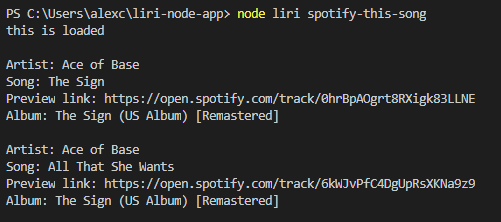
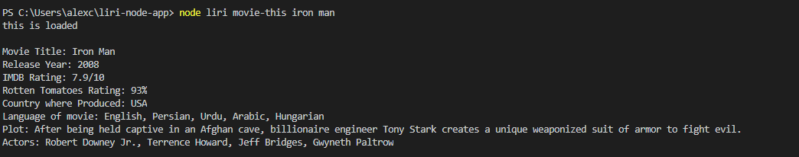
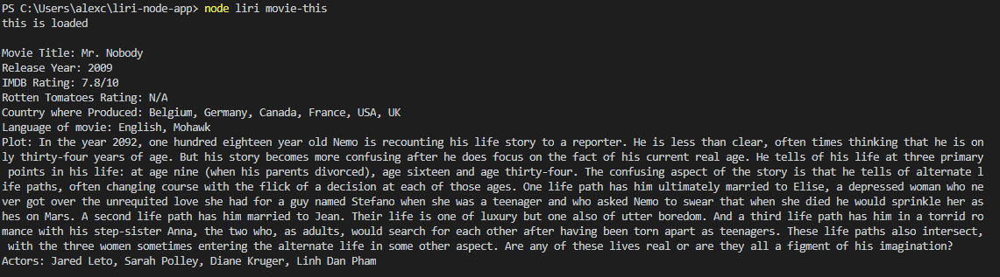
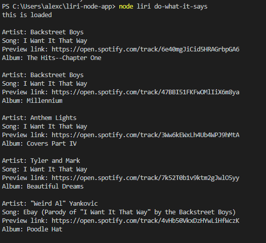

# LIRI-NODE-APP

# Homework Description

This program asks the user to provide the following input options:

* concert-this

    If user provides band/artist in console, top 5 (if present or less) concert venue names, locations, and concert dates are provided if present.

    User input should be like:

    "node liri concert-this artist/band"

    Example of input/output is shown below in screenshot:

    

    If user does not provide band/artist in console, but still calls concert-this, concerts for Drake are outputted.

    Example input/output screenshot is below:

    

* spotify-this-song

    If user provides a song name in console, top 5 (if present) closest matches are printed in console including artist, song, preview link, and album.

    User input should be like:

    "node liri spotify-this-song du hast"

    Example of input/output is shown below in screenshot:

    

    If user does not provide song in console, Ace of Base "Sign" search results are printed.

    Example of input/output is shown below in screenshot:

    

* movie-this

    If user enters movie name in console, movie information is printed including title, year, IMDB and Rotten Tomato ratings, country, language, plot, and actors.

    User input should be like (note: for certain movie titles article like "The" must be inserted to produce correct result):

    "node liri movie-this iron man"

    Example of input/output is shown below in screenshot:

    

    If user does not provide movie in console, "Mr. Nobody" movie information is displayed.

    Example of input/output is hown below in screenshot:

    

* do-what-it-says

    If user calls "do-what-it-says" command, spotify-this-song (as previously is called for "I want it that way" song).

    User input should be like:

    "node liri do-what-it-says"

    Example of input/output is hown below in screenshot:

    

# Homework Creation Process

The program was created in javascript using node.js. axios, dotenv, fs, moment, and node-spotify-api packages were used. API get calls were made to OMDB, spotify, and bands in town api using axios. This program is meant to be run on server using node. API inputs were read using fs from a random.txt.